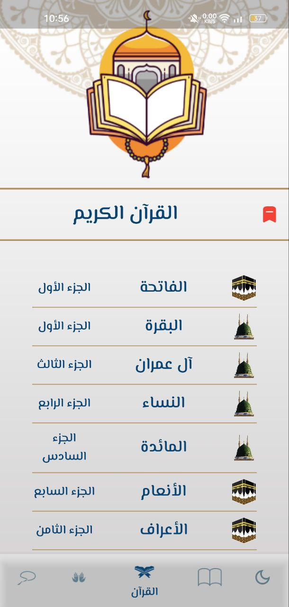

# Ana Muslim - Quran, Ahadeth, Doaa, and Sebha App

Ana Muslim is a mobile application that provides access to Quran, Ahadeth, Doaa, and Sebha. The app supports light mode and dark mode, ensuring comfortable reading for users. The codebase is well-organized and follows clean coding practices. The app functions offline, providing a seamless user experience.

## Key Features

- Quran: Access the holy Quran with translations and interpretations.
- Ahadeth: Explore a collection of authentic Ahadeeth.
- Doaa: Discover a variety of Islamic supplications (Adya).
- Sebha: Engage in Dhikr using a digital Tasbeeh counter.
- Light and Dark Mode: Choose between light and dark themes for optimal reading.
- Clean Code: Well-structured, clean code for easy understanding and maintenance.
- Offline Functionality: App works without an internet connection for uninterrupted use.
- User-Friendly UI: Intuitive and easy-to-navigate interface.

## Screenshots

| Quran Screen (Light Mode) | Quran Screen (Dark Mode) |
| :------: | :----------: |
|  |  |

| Ahadeth Screen (Light Mode) | Ahadeth Screen (Dark Mode) |
| :------: | :----------: |
|  |  |

| Adya Screen (Light Mode) | Adya Screen (Dark Mode) |
| :------: | :----------: |
|  |  |

| Sebha Screen (Light Mode) | Sebha Screen (Light Mode) |
| :------: | :----------: |
|  |  |

| Sura Screen | Doaa Screen | Hadeth Screen |
| :------: | :----------: | :----------: |
|  |  |  |

## Installation

1. Clone the repository.
2. Open the project in your preferred Flutter development environment.
3. Run the app on an emulator or physical device.

## Contributing

Contributions are welcome! Feel free to open an issue or create a pull request.

## License

[MIT License](LICENSE)

